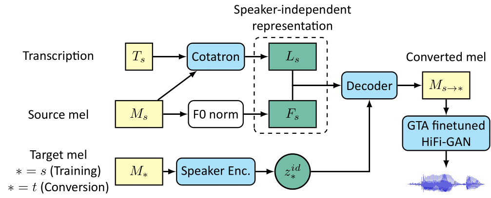
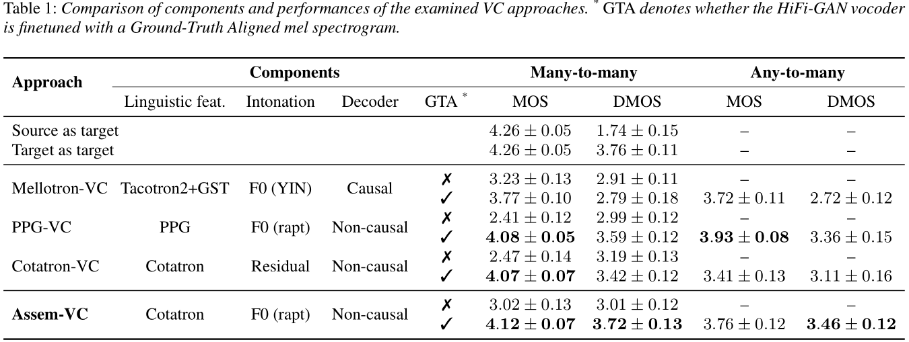

# Assem-VC &mdash; Official PyTorch Implementation



**Assem-VC: Realistic Voice Conversion by Assembling Modern Speech Synthesis Techniques**<br>
Kang-wook Kim, Seung-won Park, Myun-chul Joe @ [MINDsLab Inc.](https://maum.ai/), SNU

Paper: https://arxiv.org/abs/2104.00931 <br>
Audio Samples: https://mindslab-ai.github.io/assem-vc/ <br>

**Update: Enjoy our pre-trained model with [Google Colab notebook](https://colab.research.google.com/drive/1rj0d2Xfl0s9TmtHSrJt-8J-eVT6eOgS5?usp=sharing)!**

Abstract: *In this paper, we pose the current state-of-the-art voice conversion (VC) systems as two-encoder-one-decoder models. After comparing these models, we combine the best features and propose Assem-VC, a new state-of-the-art any-to-many non-parallel VC system. This paper also introduces the GTA finetuning in VC, which significantly improves the quality and the speaker similarity of the outputs. Assem-VC outperforms the previous state-of-the-art approaches in both the naturalness and the speaker similarity on the VCTK dataset. As an objective result, the degree of speaker disentanglement of features such as phonetic posteriorgrams (PPG) is also explored. Our investigation indicates that many-to-many VC results are no longer distinct from human speech and similar quality can be achieved with any-to-many models.*

## Requirements

This repository was tested with following environment:

- Python 3.6.8
- [PyTorch](https://pytorch.org/) 1.4.0
- [PyTorch Lightning](https://github.com/PytorchLightning/pytorch-lightning) 1.0.3
- The requirements are highlighted in [requirements.txt](./requirements.txt).

## Clone our Repository
```bash
git clone --recursive https://github.com/mindslab-ai/assem-vc
cd assem-vc
```

## Datasets

### Preparing Data

- To reproduce the results from our paper, you need to download:
  - LibriTTS train-clean-100 split [tar.gz link](http://www.openslr.org/resources/60/train-clean-100.tar.gz)
  - [VCTK dataset (Version 0.80)](https://datashare.ed.ac.uk/handle/10283/2651)
- Unzip each files, and clone them in `datasets/`.
- Resample them into 22.05kHz using `datasets/resample.py`.
  ```bash
  python datasets/resample.py
  ```
  Note that `dataset/resample.py` was hard-coded to remove original wavfiles in `datasets/` and replace them into resampled wavfiles,
  and their filename `*.wav` will be transformed into `*-22k.wav`.
- You can use `datasets/resample_delete.sh` instead of `datasets/resample.py`. It does the same role.


### Preparing Metadata

Following a format from [NVIDIA/tacotron2](https://github.com/NVIDIA/tacotron2), the metadata should be formatted like:
```
path_to_wav|transcription|speaker_id
path_to_wav|transcription|speaker_id
...
```

When you want to learn and inference using phoneme, the transcription should have only unstressed [ARPABET](https://en.wikipedia.org/wiki/ARPABET).

Metadata containing ARPABET for LibriTTS train-clean-100 split and VCTK corpus are already prepared at `datasets/metadata`.
If you wish to use custom data, you need to make the metadata as shown above.

When converting transcription of metadata into ARPABET, you can use `datasets/g2p.py`.

```bash
python datasets/g2p.py -i <input_metadata_filename_with_graphemes> -o <output_filename>
```

### Preparing Configuration Files

Training our VC system is consisted of two steps: (1) training Cotatron, (2) training VC decoder on top of Cotatron.

There are three `yaml` files in the `config` folder, which are configuration template for each model.
They **must** be edited to match your training requirements (dataset, metadata, etc.).

```bash
cp config/global/default.yaml config/global/config.yaml
cp config/cota/default.yaml config/cota/config.yaml
cp config/vc/default.yaml config/vc/config.yaml
```

Here, all files with name other than `default.yaml` will be ignored from git (see `.gitignore`).

- `config/global`: Global configs that are both used for training Cotatron & VC decoder.
  - Fill in the blanks of: `speakers`, `train_dir`, `train_meta`, `val_dir`, `val_meta`, `f0s_list_path`.
  - Example of speaker id list is shown in `datasets/metadata/libritts_vctk_speaker_list.txt`.
  - When replicating the two-stage training process from our paper (training with LibriTTS and then LibriTTS+VCTK), please put both list of speaker ids from LibriTTS and VCTK at global config.
  - `f0s_list_path` is set to `f0s.txt` by default
- `config/cota`: Configs for training Cotatron.
  - You may want to change: `batch_size` for GPUs other than 32GB V100, or change `chkpt_dir` to save checkpoints in other disk.
  - You can also modify `use_attn_loss`, whether guided attention loss is used or not.
- `config/vc`: Configs for training VC decoder.
  - Fill in the blank of: `cotatron_path`. 

### Extracting Pitch Range of Speakers

Before you train VC decoder, you should extract pitch range of each speaker:

```bash
python preprocess.py -c <path_to_global_config_yaml>
```
Result will be saved at `f0s.txt`.

## Training
Currently, the training speed via multi-GPU setting may be slow due to the version issue of pytorch lightning.
If you want to train faster, see [this issue](https://github.com/mindslab-ai/assem-vc/issues/13).
### 1. Training Cotatron
To train the Cotatron, run this command:

```bash
python cotatron_trainer.py -c <path_to_global_config_yaml> <path_to_cotatron_config_yaml> \
                           -g <gpus> -n <run_name>
```

Here are some example commands that might help you understand the arguments:

```bash
# train from scratch with name "my_runname"
python cotatron_trainer.py -c config/global/config.yaml config/cota/config.yaml \
                           -g 0 -n my_runname
```

Optionally, you can resume the training from previously saved checkpoint by adding `-p <checkpoint_path>` argument.

### 2. Training VC decoder

After the Cotatron is sufficiently trained (i.e., producing stable alignment + converged loss),
the VC decoder can be trained on top of it.

```bash
python synthesizer_trainer.py -c <path_to_global_config_yaml> <path_to_vc_config_yaml> \
                              -g <gpus> -n <run_name>
```

The optional checkpoint argument is also available for VC decoder.

### 3. GTA finetuning HiFi-GAN

Once the VC decoder is trained, finetune the HiFi-GAN with GTA finetuning.
First, you should extract GTA mel-spectrograms from VC decoder.
```bash
python gta_extractor.py -c <path_to_global_config_yaml> <path_to_vc_config_yaml> \
                        -p <checkpoint_path>
```
The GTA mel-spectrograms calculated from audio file will be saved as `**.wav.gta` at first, 
and then loaded from disk afterwards.

Train/validation metadata of GTA mels will be saved in `datasets/gta_metadata/gta_<orignal_metadata_name>.txt`.
You should use those metadata when finetuning HiFi-GAN.

After extracting GTA mels, get into hifi-gan and follow manuals in [hifi-gan/README.md](https://github.com/wookladin/hifi-gan/blob/master/README.md)
```bash
cd hifi-gan
```

### Monitoring via Tensorboard

The progress of training with loss values and validation output can be monitored with tensorboard.
By default, the logs will be stored at `logs/cota` or `logs/vc`, which can be modified by editing `log.log_dir` parameter at config yaml file.

```bash
tensorboard --log_dir logs/cota --bind_all # Cotatron - Scalars, Images, Hparams, Projector will be shown.
tensorboard --log_dir logs/vc --bind_all # VC decoder - Scalars, Images, Hparams will be shown.
```

## Pre-trained Weight
We provide pretrained model of Assem-VC and GTA-finetuned HiFi-GAN generator weight.
Assem-VC was trained with VCTK and LibriTTS, and HiFi-GAN was finetuned with VCTK.

1. Download our published [models and configurations](https://drive.google.com/drive/folders/1aIl8ObHxsmsFLXBz-y05jMBN4LrpQejm?usp=sharing).
2. Place `global/config.yaml` at `config/global/config.yaml`, and `vc/config.yaml` at `config/vc/config.yaml`
3. Download `f0s.txt` and write the relative path of it at `hp.data.f0s_list_path`.
(Default path is `f0s.txt`)
4. write path of pretrained Assem-VC and HiFi-GAN models in [inference.ipynb](./inference.ipynb).

## Inference

After the VC decoder and HiFi-GAN are trained, you can use an arbitrary speaker's speech as the source.
You can convert it to speaker contained in trainset: which is any-to-many voice conversion.
1. Add your source audio(.wav) in `datasets/inference_source`
2. Add following lines at `datasets/inference_source/metadata_origin.txt`
    ```
    your_audio.wav|transcription|speaker_id
    ```
    Note that speaker_id has no effect whether or not it is in the training set.
3. Convert `datasets/inference_source/metadata_origin.txt` into ARPABET.
    ```bash
    python datasets/g2p.py -i datasets/inference_source/metadata_origin.txt \
                            -o datasets/inference_source/metadata_g2p.txt
    ```
4. Run [inference.ipynb](./inference.ipynb)

We provide three samples including single TTS sample from [VITS demo page](https://jaywalnut310.github.io/vits-demo/index.html) for source audio.

**Note that source speech should be clean and the volume should not be too low.**

## Results



*Disclaimer: We used an open-source g2p system in this repository, which is different from the proprietary g2p mentioned in the paper.
Hence, the quality of the result may differ from the paper.*

## Implementation details

Here are some noteworthy details of implementation, which could not be included in our paper due to the lack of space:

- Guided attention loss <br>
  We applied guided attention loss proposed in [DC-TTS](https://arxiv.org/abs/1710.08969).
  It helped Cotatron's alignment learning stable and faster convergence.
  See [modules/alignment_loss.py](./modules/alignment_loss.py).

## License

BSD 3-Clause License.

## Citation & Contact

```bibtex
@article{kim2021assem,
  title={Assem-VC: Realistic Voice Conversion by Assembling Modern Speech Synthesis Techniques},
  author={Kim, Kang-wook and Park, Seung-won and Joe, Myun-chul},
  journal={arXiv preprint arXiv:2104.00931},
  year={2021}
}
```

If you have a question or any kind of inquiries, please contact Kang-wook Kim at [kwkim@mindslab.ai](mailto:kwkim@mindslab.ai)


## Repository structure
```
.
├── LICENSE
├── README.md
├── cotatron.py
├── cotatron_trainer.py         # Trainer file for Cotatron
├── gta_extractor.py            # GTA mel spectrogram extractor
├── inference.ipynb
├── preprocess.py               # Extracting speakers' pitch range
├── requirements.txt
├── synthesizer.py
├── synthesizer_trainer.py      # Trainer file for VC decoder (named as "synthesizer")
├── config
│   ├── cota
│   │   └── default.yaml        # configuration template for Cotatron
│   ├── global
│   │   └── default.yaml        # configuration template for both Cotatron and VC decoder
│   └── vc
│        └── default.yaml       # configuration template for VC decoder
├── datasets                    # TextMelDataset and text preprocessor
│   ├── __init__.py         
│   ├── g2p.py                  # Using G2P to convert metadata's transcription into ARPABET
│   ├── resample.py             # Python file for audio resampling
│   └── text_mel_dataset.py
│   ├── inference_source
│   │    (omitted)              # custom source speechs and transcriptions for inference.ipynb
│   ├── inference_target
│   │    (omitted)              # target speechs and transcriptions of VCTK for inference.ipynb
│   ├── metadata
│   │    (ommited)              # Refer to README.md within the folder.
│   └── text
│        ├── __init__.py
│        ├── cleaners.py
│        ├── cmudict.py
│        ├── numbers.py
│        └── symbols.py
├── docs                        # Audio samples and code for https://mindslab-ai.github.io/assem-vc/
│   (omitted)
├── hifi-gan                    # Modified HiFi-GAN vocoder (https://github.com/wookladin/hifi-gan)
│   (omitted)
├── modules                     # All modules that compose model, including mel.py
│   ├── __init__.py
│   ├── alignment_loss.py       # Guided attention loss
│   ├── attention.py            # Implementation of DCA (https://arxiv.org/abs/1910.10288)
│   ├── classifier.py
│   ├── cond_bn.py
│   ├── encoder.py
│   ├── f0_encoder.py
│   ├── mel.py                  # Code for calculating mel-spectrogram from raw audio
│   ├── tts_decoder.py
│   ├── vc_decoder.py
│   └── zoneout.py              # Zoneout LSTM
└── utils                       # Misc. code snippets, usually for logging
    ├── loggers.py
    ├── plotting.py
    └── utils.py
```

## References

This implementation uses code from following repositories:
- [Keith Ito's Tacotron implementation](https://github.com/keithito/tacotron/)
- [NVIDIA's Tacotron2 implementation](https://github.com/NVIDIA/tacotron2)
- [Official Mellotron implementation](https://github.com/NVIDIA/mellotron)
- [Official HiFi-GAN implementation](https://github.com/jik876/hifi-gan)
- [Official Cotatron implementation](https://github.com/mindslab-ai/cotatron)
- [Kyubyong's g2pE implementation](https://github.com/Kyubyong/g2p)
- [Tomiinek's Multilngual TTS implementation](https://github.com/Tomiinek/Multilingual_Text_to_Speech)

This README was inspired by:
- [Tips for Publishing Research Code](https://github.com/paperswithcode/releasing-research-code)

The audio samples on our [webpage](https://mindslab-ai.github.io/assem-vc/) are partially derived from:
- [LibriTTS](https://arxiv.org/abs/1904.02882): Dataset for multispeaker TTS, derived from LibriSpeech.
- [VCTK](https://datashare.ed.ac.uk/handle/10283/2651): 46 hours of English speech from 108 speakers.
- [KSS](https://www.kaggle.com/bryanpark/korean-single-speaker-speech-dataset): Korean Single Speaker Speech Dataset.
